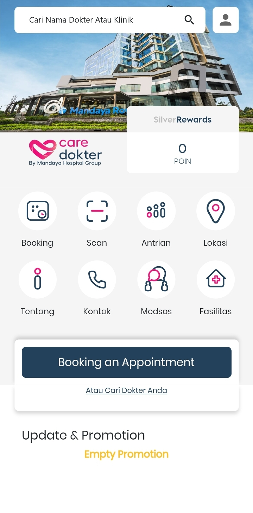
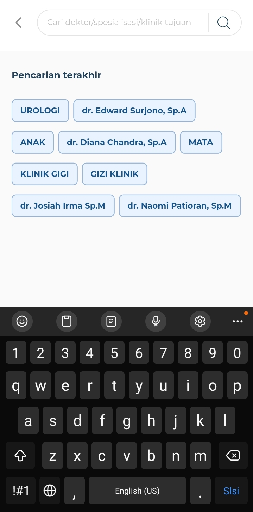
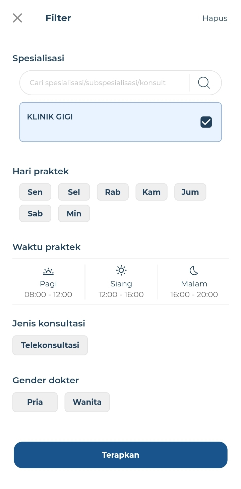
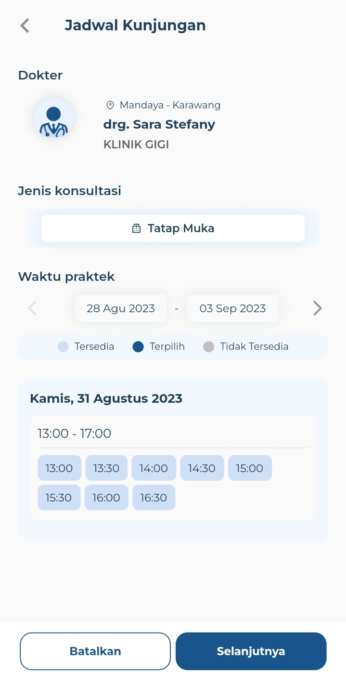
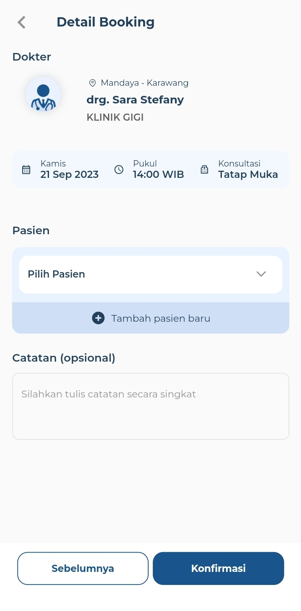
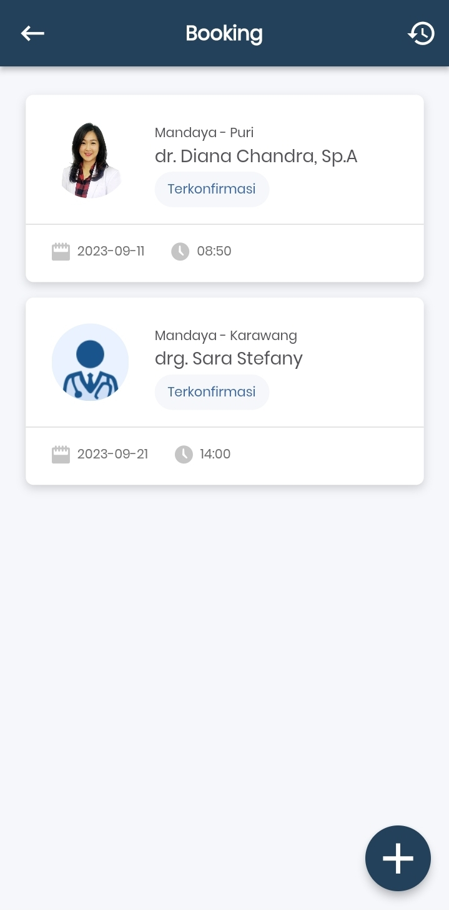
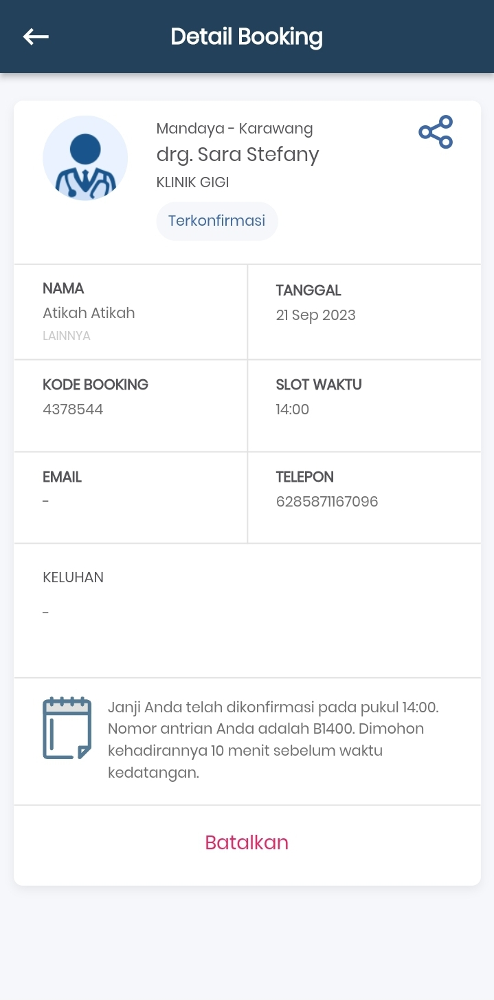
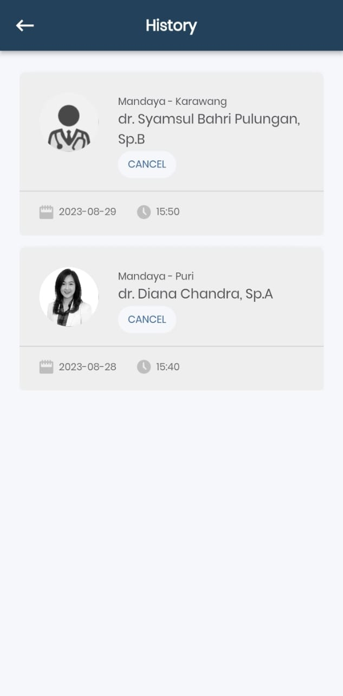

# Care Doctor Application API Documentation

Welcome to the API documentation for the Care Doctor Application. This guide outlines the API endpoints that use the HTTP GET method for making reservations.

## Endpoints

### 1. Get Total Points

- Endpoint: `/api/users/points`
- Method: GET
- Description: Get the total points of the user's account.
- 

### 2. Get Specializations and Sub Specializations

- Endpoint: `/api/specializations`
- Method: GET
- Query Parameters:
  - `location`: Hospital location
- Description: Get the list of specializations and sub specialization names based on the current hospital location.
- 

### 3. Search for Doctors

- Endpoint: `/api/doctors`
- Method: GET
- Query Parameters:
  - `location`: Hospital location
  - `search`: Search term for doctor name, specialization name, or sub specialization name.
- Description: Get a list of doctors based on the search criteria.
- 

### 4. Filter Doctors

- Endpoint: `/api/doctors`
- Method: GET
- Query Parameters:
  - `specialization`: Specialization name
  - `practice_day`: Practice day
  - `practice_time_start`: Practice start time in the format "HH:mm"
  - `practice_time_end`: Practice end time in the format "HH:mm"
  - `booking_type`: Booking type
  - `gender`: Doctor's gender
- Description: Get a list of doctors based on various filter criteria.
- 

### 5. Get Doctor's Practice Schedules

- Endpoint: `/api/doctors/{doctor_id}/schedules`
- Method: GET
- Query Parameters:
  - `start_date`: Start date in the format "YYYY-MM-DD"
  - `end_date`: End date in the format "YYYY-MM-DD"
- Description: Get the list of a doctor's schedules within a specified date range.
- 

### 6. Get Family Member Names

- Endpoint: `/api/family-members`
- Method: GET
- Description: Get a list of family member names to be used as a patient when making a reservation.
- 

### 7. Get Bookings

- Endpoint: `/api/bookings`
- Method: GET
- Description: Get a list of the user's bookings that are currently in progress.
- 

### 8. Get Detailed Booking Information

- Endpoint: `/api/bookings/{booking_id}`
- Method: GET
- Description: Get detailed information about a specific booking ID.
- 

### 9. Get Booking History

- Endpoint: `/api/bookings/histories`
- Method: GET
- Description: Get a list of booking histories for a specific user.
- 